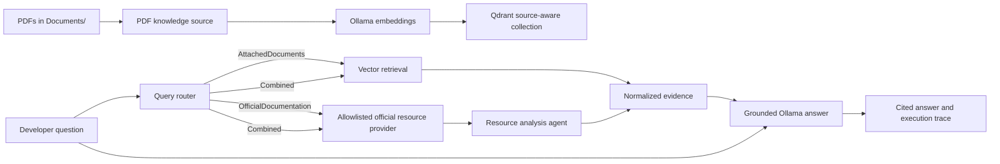

# Agentic Developer Knowledge Hub

A local-first C# knowledge hub for software developers and architects. The application combines attached PDF knowledge with curated official Microsoft/.NET documentation. A router selects the evidence path, specialist services retrieve and analyze sources, and the final RAG response includes grounding metadata and citations.

## Architecture



The current implementation has these responsibilities:

- `RuleBasedQueryRouter` selects attached documents, official documentation, or both.
- `PdfKnowledgeSource` indexes every PDF in `Documents/` and preserves page metadata.
- `OfficialResourceProvider` fetches only HTTPS resources from the configured Microsoft/.NET allowlist.
- `ResourceAnalyzer` converts fetched resources into normalized evidence.
- `KnowledgeCoordinator` runs the selected branches and passes their evidence to the final generator.
- `QdrantVectorStore` stores source-aware chunks with stable identifiers for repeatable indexing.

The local provider boundary is intentionally explicit. Microsoft Foundry/Azure can be added as a hosted model or remote-agent provider later without changing the query, evidence, or answer contracts. Azure credentials are not required for this local milestone.

## Requirements

- macOS or another operating system supported by .NET
- .NET 10 SDK
- Ollama running at `http://localhost:11434`
- Qdrant running with its gRPC endpoint at `localhost:6334`
- At least one text-based PDF in `Documents/`

Start the local services:

```bash
ollama pull nomic-embed-text
ollama pull llama3.2
docker run --name qdrant -p 6333:6333 -p 6334:6334 qdrant/qdrant
```

Run from the repository root:

```bash
dotnet restore
dotnet run
```

The application indexes all PDFs before opening the question loop:

```text
Indexed 15 document chunks from the configured knowledge base.
Agentic developer knowledge hub ready.
Ask a question, or type 'exit' to quit.
```

## Routing behavior

Questions mentioning an attached document, PDF, or document content use the local Qdrant knowledge base. Questions asking for official, current, documentation, or API-reference information use the allowlisted official sources. A question that requests both attached context and current official information uses both branches.

Official research currently uses a small built-in Microsoft/.NET catalog:

- `learn.microsoft.com`
- `dotnet.microsoft.com`
- `docs.microsoft.com`

The allowlist is checked before fetching. Fetched pages are cited by URL. Attached material is cited by document name and page when page metadata is available.

## Configuration

Configuration is read from environment variables, with these defaults:

| Variable | Default | Purpose |
| --- | --- | --- |
| `RAG_DOCUMENTS_PATH` | `Documents` | PDF directory |
| `OLLAMA_URL` | `http://localhost:11434` | Ollama endpoint |
| `OLLAMA_EMBEDDING_MODEL` | `nomic-embed-text` | Embedding model |
| `OLLAMA_GENERATIVE_MODEL` | `llama3.2` | Answer model |
| `QDRANT_HOST` | `localhost` | Qdrant host |
| `QDRANT_PORT` | `6334` | Qdrant gRPC port |
| `QDRANT_COLLECTION` | `rag-on-mac` | Vector collection |
| `RAG_CHUNK_SIZE` | `800` | Chunk size in characters |
| `RAG_CHUNK_OVERLAP` | `100` | Chunk overlap in characters |
| `RAG_RETRIEVAL_LIMIT` | `5` | Retrieved document chunks |
| `RAG_OFFICIAL_DOMAINS` | Microsoft/.NET domains | Comma-separated HTTPS allowlist |

For example:

```bash
RAG_RETRIEVAL_LIMIT=8 RAG_OFFICIAL_DOMAINS=learn.microsoft.com,dotnet.microsoft.com dotnet run
```

Chunk IDs are deterministic for a document name, page, index, and text, so restarting the application upserts the same Qdrant points. Existing points from removed documents are not automatically deleted yet; use a new collection name or remove the old collection when replacing a knowledge base.

## Tests

The focused tests use no network, Ollama, Qdrant, or Azure credentials:

```bash
dotnet test RAGOnMyMac.Tests/RAGOnMyMac.Tests.csproj
```

They currently cover route selection and evidence analysis. A live smoke test requires both local services and a PDF.

## Trust boundaries and limitations

- The initial external catalog is curated; this is not an open-web search engine.
- HTML extraction is intentionally lightweight and should be replaced with a stronger content parser as source coverage grows.
- The current router is deterministic. A model-backed planner can implement the same `IQueryRouter` contract later.
- The resource analyzer currently normalizes source evidence and claims; it does not yet perform deep semantic claim verification.
- Scanned PDFs, OCR, non-PDF formats, broad vendor coverage, and autonomous write actions are not implemented.
- Remote Microsoft Foundry agent-to-agent communication is an extension point, not a local runtime dependency.

## Project structure

```text
RAGOnMyMac/
├── Agents/
│   ├── AgentServices.cs
│   └── KnowledgeCoordinator.cs
├── Configuration/
│   └── KnowledgeHubOptions.cs
├── Knowledge/
│   ├── OfficialResourceProvider.cs
│   └── PdfKnowledgeSource.cs
├── Models/
│   ├── AgentModels.cs
│   ├── DocumentChunk.cs
│   └── SearchResult.cs
├── RAGOnMyMac.Tests/
├── Program.cs
├── OllamaService.cs
└── QdrantVectorStore.cs
```