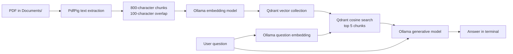

# RAG On My Mac

A local Retrieval-Augmented Generation (RAG) command-line application written in C#. It extracts text from a PDF, creates embeddings with Ollama, stores the embeddings in Qdrant, and answers questions using retrieved PDF content.

## How It Works



At startup, the application:

1. Finds a PDF in `Documents/`.
2. Extracts text from every PDF page using PdfPig.
3. Splits the extracted text into overlapping chunks.
4. Generates an embedding for each chunk with `nomic-embed-text`.
5. Stores the chunks and embeddings in the `rag-on-mac` Qdrant collection.
6. Starts an interactive question-and-answer loop.

For each question, the application retrieves the five most similar chunks and sends only those chunks, together with the question, to `llama3.2`.

## Requirements

- macOS or another operating system supported by .NET and the local services
- .NET 10 SDK
- [Ollama](https://ollama.com/) running at `http://localhost:11434`
- Qdrant running with its gRPC endpoint available at `localhost:6334`
- A text-based PDF file in the `Documents/` folder

The application currently expects exactly one PDF in `Documents/`. The checked-in example is `Documents/aspnc.pdf`. The file name does not need to be `aspnc.pdf`, but it must have a `.pdf` extension.

## Start the Services

Verify Ollama:

```bash
curl http://localhost:11434/api/tags
```

Download the models used by the application:

```bash
ollama pull nomic-embed-text
ollama pull llama3.2
```

Start Qdrant with Docker:

```bash
docker run --name qdrant -p 6333:6333 -p 6334:6334 qdrant/qdrant
```

The application uses Qdrant's gRPC port, `6334`.

## Run the Application

From the repository root:

```bash
dotnet restore
dotnet run
```

The application indexes the PDF before displaying the prompt:

```text
Indexed 15 document chunks.

Ask a question about the document.
Type 'exit' to quit.

You: What is the main topic of this document?
Assistant: ...
```

Type `exit` to stop the application. Blank questions are ignored.

## Configuration

The current configuration is defined as constants at the top of `Program.cs`:

| Setting           | Current value            | Purpose                                         |
| ----------------- | ------------------------ | ----------------------------------------------- |
| `ollamaUrl`       | `http://localhost:11434` | Ollama HTTP endpoint                            |
| `embeddingModel`  | `nomic-embed-text`       | Model used for document and question embeddings |
| `generativeModel` | `llama3.2`               | Model used to generate answers                  |
| `qdrantHost`      | `localhost`              | Qdrant host                                     |
| `qdrantPort`      | `6334`                   | Qdrant gRPC port                                |
| `collectionName`  | `rag-on-mac`             | Qdrant collection name                          |

The chunking settings are currently defined in `SplitDocument`:

- Chunk size: `800` characters
- Overlap: `100` characters
- Search limit: `5` chunks per question

Changing these values requires editing the source and rerunning the application.

## Project Structure

```text
RAGOnMyMac/
├── Program.cs                         # PDF indexing and interactive Q&A loop
├── OllamaService.cs                   # Ollama embedding and generation calls
├── IOllamaService.cs                  # Ollama service contract
├── QdrantVectorStore.cs               # Collection, storage, and similarity search
├── Models/
│   ├── DocumentChunk.cs               # Chunk identity, document name, index, and text
│   ├── SearchResult.cs                # Retrieved chunk and similarity score
│   ├── OllamaEmbeddingResponse.cs     # Ollama embedding response model
│   └── OllamaGenerateResponse.cs      # Ollama generation response model
├── Documents/
│   └── aspnc.pdf                      # PDF input document
├── RAGOnMyMac.csproj                   # .NET project and package references
└── README.md                          # Project documentation
```

## Dependencies

The project uses:

- `Qdrant.Client` `1.19.0` for vector storage and cosine similarity search
- `UglyToad.PdfPig` `1.7.0-custom-5` for PDF text extraction

The Ollama models and Qdrant server are external local services, not NuGet dependencies.

## Important Limitations

- **Text-based PDFs only:** PdfPig extracts embedded PDF text. Scanned or image-only PDFs require OCR, which is not currently implemented.
- **One PDF per run:** `Directory.GetFiles("Documents", "*.pdf").SingleOrDefault()` requires exactly one matching PDF. Zero PDFs produces an error; multiple PDFs cause startup to fail.
- **Relative paths:** Run the application from the repository root so the relative `Documents/` path resolves correctly.
- **Re-indexing:** The application indexes the PDF on every startup. Existing points remain in Qdrant, so changing the PDF can leave old chunks in the collection. Delete the `rag-on-mac` collection or change `collectionName` before indexing a replacement document.
- **No page metadata:** Stored metadata contains the PDF file name, chunk index, and text, but not the source page number.
- **No automated test project:** Validation currently consists of building and running the application against the local Ollama and Qdrant services.

## Troubleshooting

### No PDF found

Place exactly one `.pdf` file in `Documents/`, then run the application from the repository root.

### Multiple PDFs found

Move all but one PDF out of `Documents/`. Multi-document indexing is not implemented yet.

### Ollama connection failure

Confirm that Ollama is running and that the endpoint responds:

```bash
curl http://localhost:11434/api/tags
```

Also confirm that both required models have been downloaded:

```bash
ollama list
```

### Qdrant connection failure

Confirm that the Qdrant container is running and that port `6334` is published:

```bash
docker ps
```

### Model not found

Pull the missing model:

```bash
ollama pull nomic-embed-text
ollama pull llama3.2
```

### Stale answers after replacing the PDF

Delete the existing `rag-on-mac` collection before re-indexing, or change `collectionName` in `Program.cs`. The current application does not remove old vectors automatically.

## Build

```bash
dotnet build
```

The project targets `net10.0` and uses nullable reference types and implicit global usings.

## Possible Extensions

- Support multiple PDFs and store document-level metadata.
- Add OCR for scanned PDFs.
- Preserve page numbers in chunks and cite source pages in answers.
- Move configuration to `appsettings.json` or environment variables.
- Add collection cleanup and incremental indexing.
- Add automated tests for PDF extraction, chunking, and retrieval.
- Expose the RAG pipeline through a web API or user interface.

## License

This project is provided as-is for educational purposes.
